# NCTaskManager - підготовка до виконання
У даному файлі описано необхідні кроки для початку виконання практичних робіт

Підготовка до виконання практичних робіт
--------------
Для виконання роботи необхідно здійснити наступні приготування:
1. [Встановити JDK](#встановлення-jdk)
2. [Встановити Git](#встановлення-git)
3. [Встановити Intellij IDEA](#встановлення-intellij-idea)
4. [Розгорнути проєкт](#Розгортання-проекту)
5. [Налаштувати проєкт](#налаштування-проекту)
6. [Встановити плагіни](#встановлення-плагінів)

## Встановлення JDK
Для виконання практичних робіт необхідно мати JDK версії 8 або вище

#### Завантаження
1. Для завантаження JDK 8 перейдіть за [посиланням](https://www.oracle.com/technetwork/java/javase/downloads/jdk8-downloads-2133151.html)
2. Виберіть чекбокс Accept License Agreement та завантажте інсталятор JDK для **вашої** операційної системи
#### Встановлення
3. Запустіть інсталятор, який ви завантажили
4. Слідуйте етапам в інсталяторі до успішного встановлення

## Встановлення Git
#### Завантаження
1. Для завантаження Git перейдіть за [посиланням](https://git-scm.com/downloads)
2. Завантажте інсталятор Git для **вашої** операційної системи
#### Встановлення
3. Запустіть інсталятор, який ви скачали
4. Слідуйте етапам в інсталяторі до успішного встановлення

## Встановлення Intellij IDEA
Для виконання практичних робіт достатньо мати IntelliJ IDEA Community

#### Завантаження
1. Для завантаження Intellij IDEA перейдіть за [посиланням](https://www.jetbrains.com/idea/download/#section=windows)
2. Завантажте інсталятор Intellij IDEA для **вашої** операційної системи
#### Встановлення
3. Запустіть інсталятор, який ви завантажили
4. Слідуйте етапам в інсталяторі до успішного встановлення

## Розгортання проєкту
1. Запустіть Intellij IDEА.
2. Коли ви вперше відкриєте Intellij IDEА, вас зустріне стартове вікно. Натисніть на `Open`.
 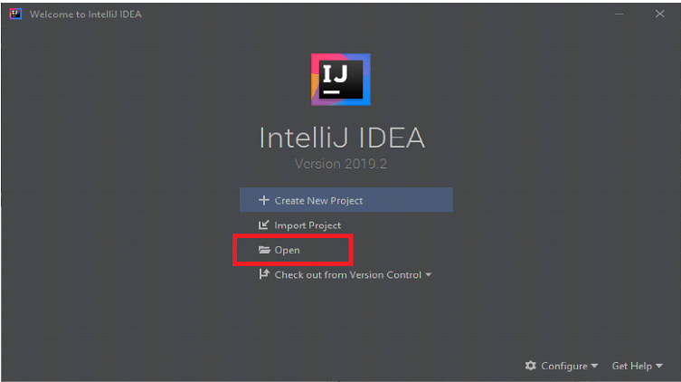
3. У вікні `Open File or Project` вкажіть директорію, в якій знаходиться проєкт, та натисніть ОК. Після цього проєкт буде відкрито в Intellij IDEА.
 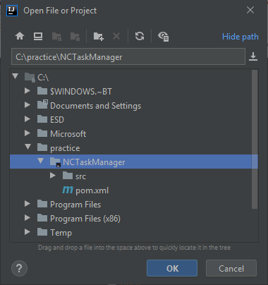
 
## Налаштування проекту
На даному етапі проєкт має наступний вигляд 
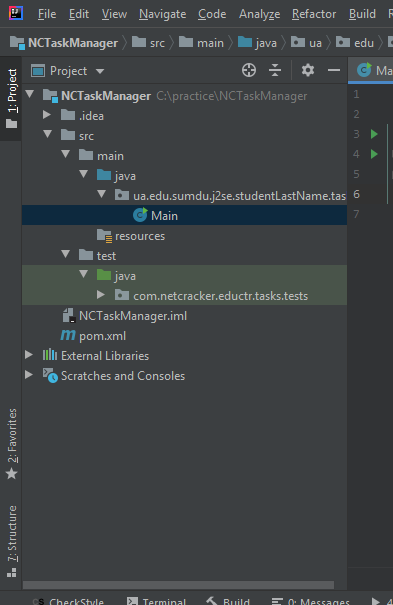

В директорії src/main будуть знаходитися ваші класи, які ви будете створювати під час виконання практичних робіт. 
Зараз там знаходиться клас Main, який знадобиться далі для налаштування проєкту. 
В директорії src/test знаходяться юніт-тести. Вони знадобляться при виконанні завдань практичних робіт. 
pom.xml - файл, у якому зберігаються налаштування залежностей проєкту.

1. У верхньому правому кутку натисніть `Project Structure` або комбінацію клавіш `Ctrl+Alt+Shift+S`. 
2. У вікні `Project Structure` виберіть `Project` з розділу `Project Settings`.
3. Якщо у полі `Project SDK` бачите `<No SDK>`, натисніть `New... > JDK`. 
4. У вікні `Select Home Directory for JDK` оберіть папку, в якій було встановлено JDK на кроці [Встановлення JDK](#встановлення-jdk),
та натисніть `OK`.
5. Натисніть `Apply > OK`
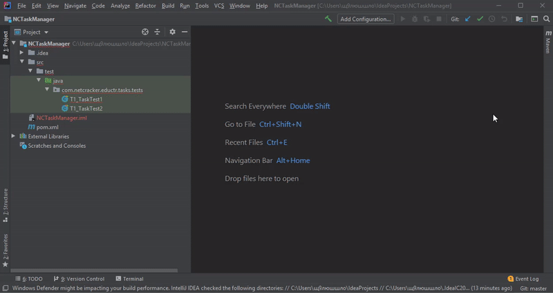

У кожного студента повинен бути унікальний пакет зі своїми класами. Для цього необхідно перейменувати існуючий пакет.

6. Відкрийте клас `Main`. 
7. Виділіть слово `studentName`, натисніть `ПКМ > Refactor > Rename...`. 
8. Замість `studentName` впишіть **своє** прізвище.                                                                            
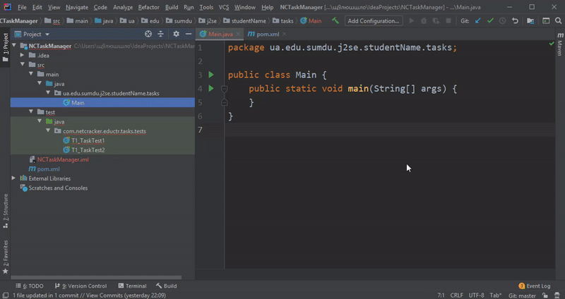

Впевніться, що обрані опції `Search in comments and strings` та `Search for text occurrences`. Натисніть `Refactor`.
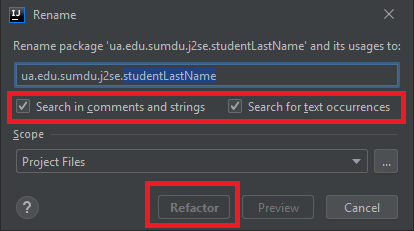

Спробуємо зібрати та запустити проєкт. У класі Main натисніть в будь-якому місці правою кнопкою миші > Run ‘Main.main()’.
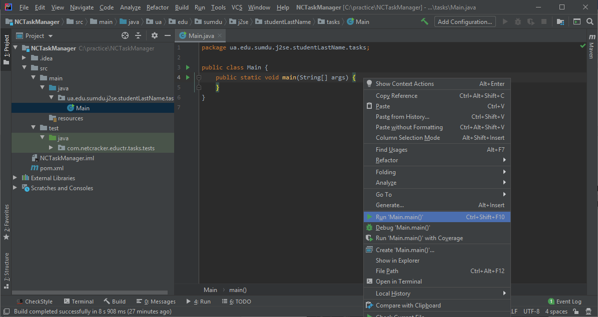
Якщо проєкт успішно зібрався, ви не побачите жодних помилок в консолі.
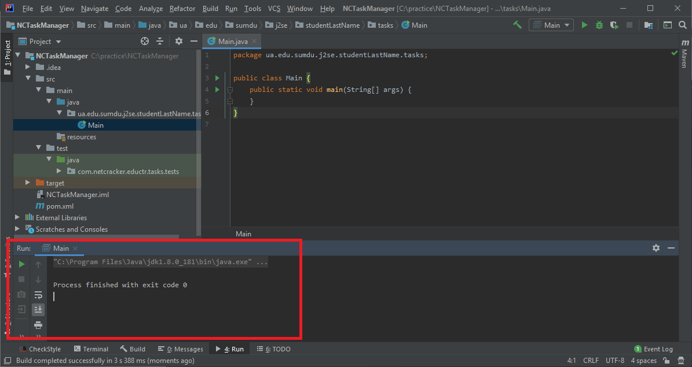

Залишилось налаштувати запуск юніт-тестів. Це можна зробити 2 способами:

- для запуску тестів, не використовуючи особливості інтеграції maven в Intellij IDEА  

1. Натисніть `Add Configuration` у верхній частині вікна. 
2. У вікні `Run\Debug Configurations` зверху зліва натисніть `+ > JUnit`. 
3. У вкладці `Configuration` у полі `Test kind` виберіть з випадаючого списку `All in package` та у поле `Package:`
вставте `com.netcracker.eductr.tasks.tests`. 
4. Натисніть `Apply > OK`
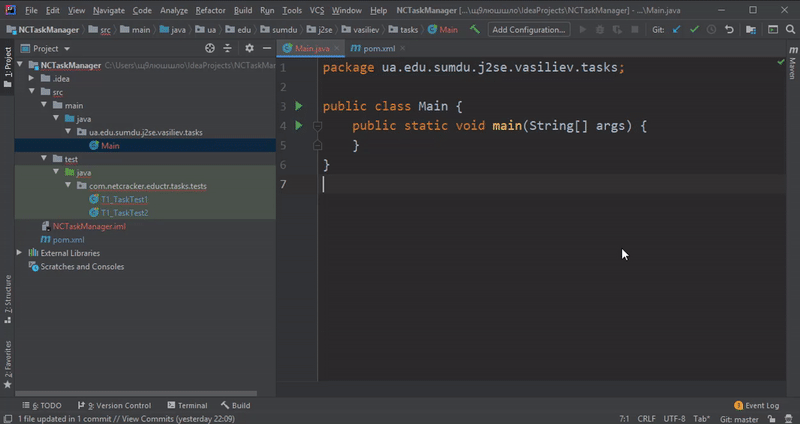

- для запуску тестів, використовуючи особливості інтеграції maven в Intellij IDEА  

1. Натисніть `Maven` у верхній частині робочої області Intellij IDEА.
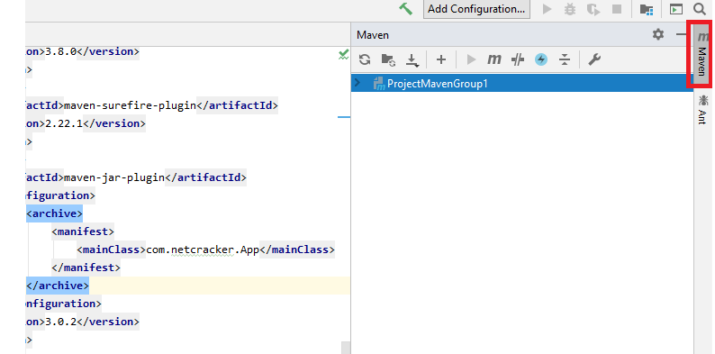

2. У відкритому вікні виберіть ваш проєкт NCTaskManager та натисніть на `Lifecycle`. Зі списку виберіть пункт `test` та спробуйте натиснути зелену кнопку `Run Maven Build`.
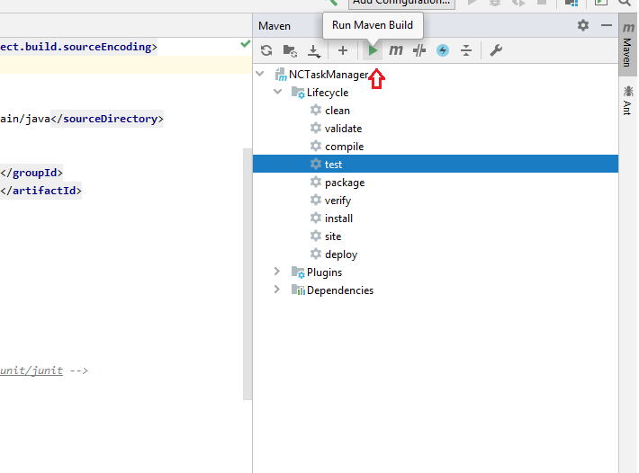

3. Переконайтесь, що проєкт зібрався успішно
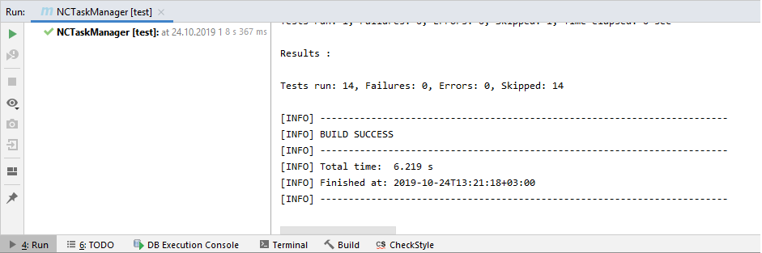

Увага! Проєкт налаштований таким чином, що в залежності від кількості створених класів та коду в них самих може запускатися різна кількість тестів.

## Встановлення плагінів

У даному розділі буде розглянуто встановлення плагіну CheckStyle. Це можна зробити 2 способами:

- встановити плагін в середовище створення програм Intellij IDEА 

1. Натисніть `File > Settings...`.
2. У вікні `Settings` перейдіть до розділу `Plugins`.
3. У вкладці `Marketplace` у поле пошуку вставте `CheckStyle-IDEA`.
4. Натисніть `Install` для знайденого плагіну. Після успішного завантаження **необхідний** перезапуск Intellij IDEA.
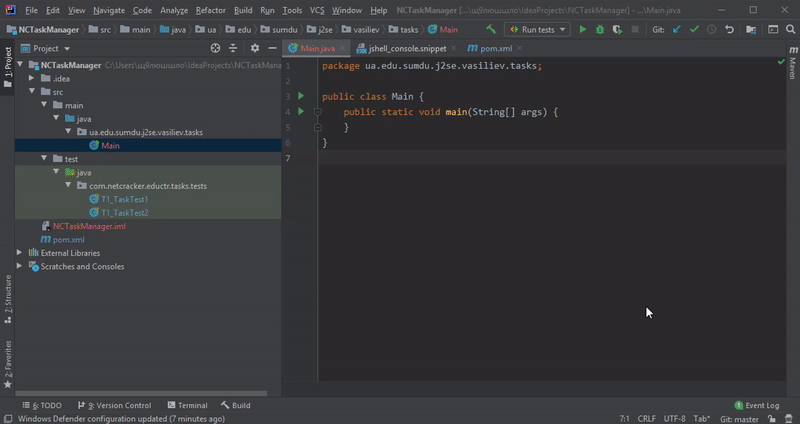

- додати плагін у відкритий maven-проєкт 

1. Відкрийте pom-файл вашого maven-проєкту.
2. У правильній секції файлу вставте використання необхідного плагіну.
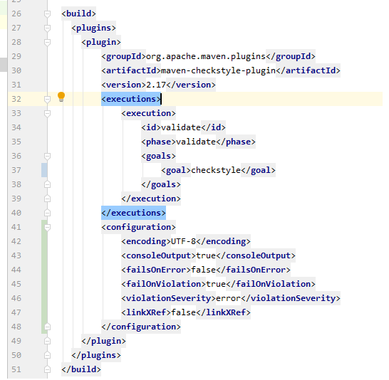
3. Більше про плагін можна дізнатися за [посиланням](https://maven.apache.org/plugins/maven-checkstyle-plugin/).

Увага! Також дозволяється використовувати інші корисні плагіни для поліпшення якості коду, такі як [pmd](https://maven.apache.org/plugins/maven-pmd-plugin/) або [findbugs](https://gleclaire.github.io/findbugs-maven-plugin/)